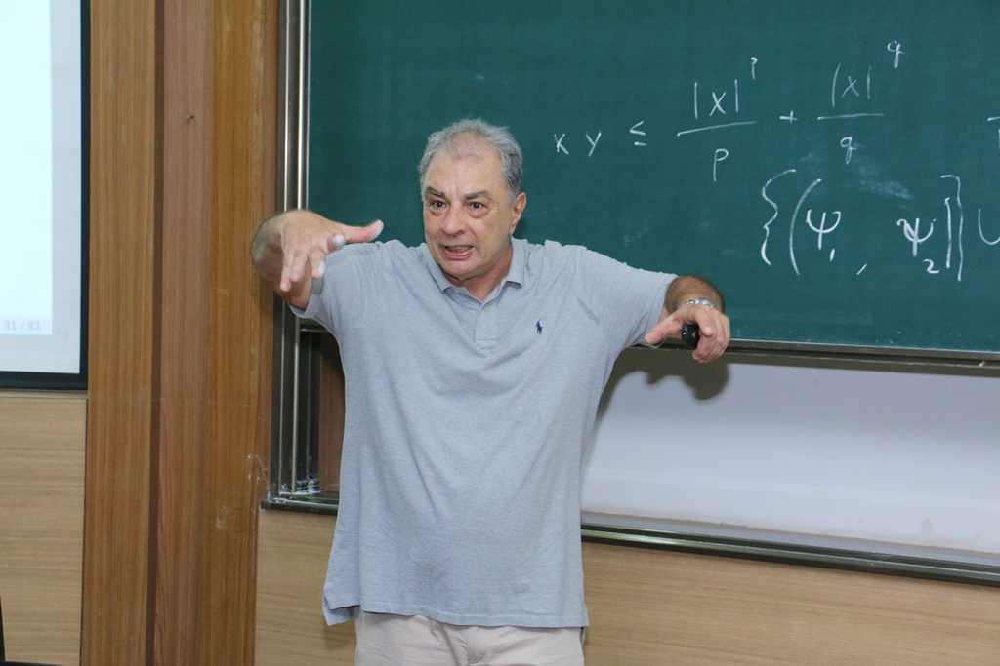
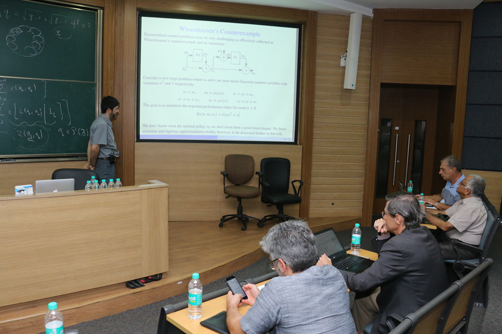
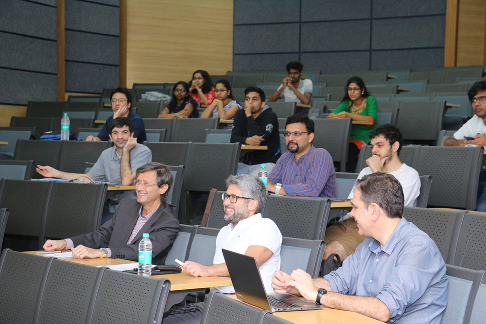
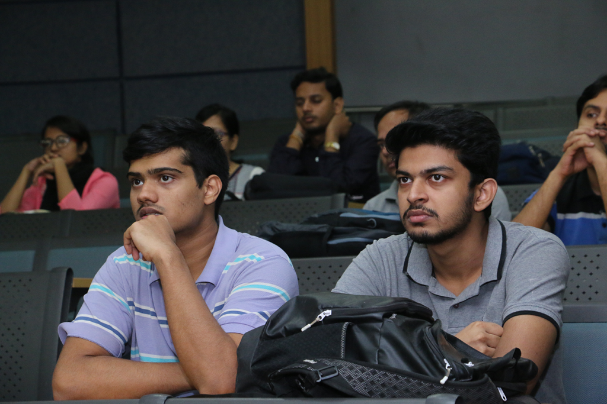
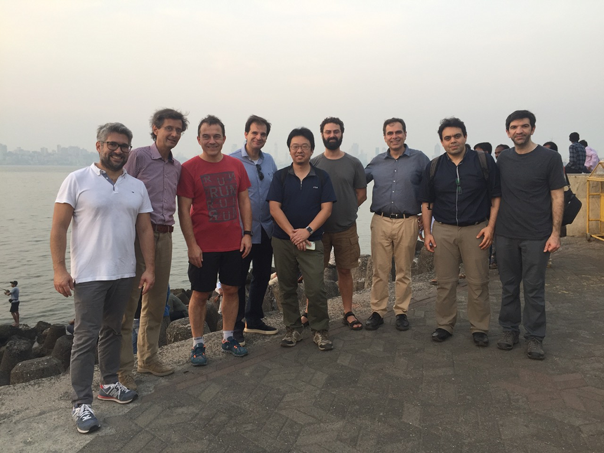
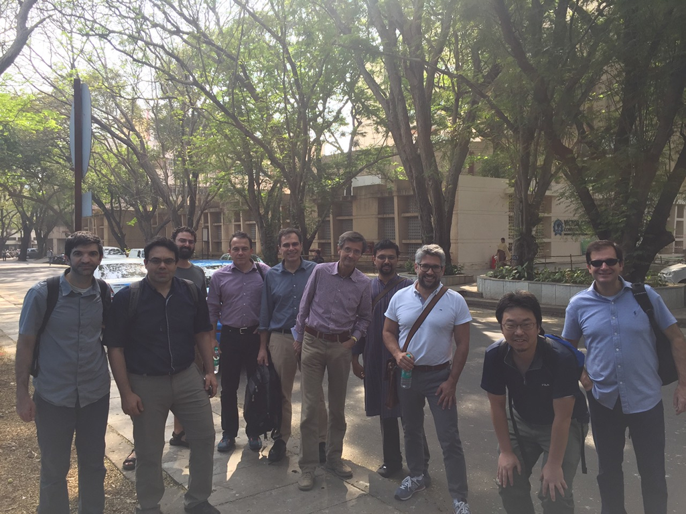
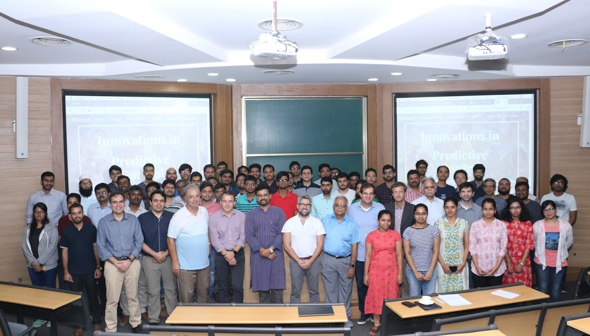

= IEEE Workshop on Innovations in Predictive Control 2018: report

:toc2:

== Overview

The IEEE Workshop on Innovations in Predictive Control (https://sites.google.com/view/ipc2018[IPC2018]) was held at IIT Bombay, Mumbai, India, during 25-29 Nov 2018. It was organized under the aegis of the IEEE CSS Outreach Funds by https://ei.uni-paderborn.de/rat/[Daniel Quevedo] (Paderborn University, Germany), http://www.sc.iitb.ac.in/~chatterjee[Debasish Chatterjee] and https://www.ee.iitb.ac.in/web/faculty/homepage/borkar[Vivek Borkar] (IIT Bombay), with additional support from https://new.abb.com/[ABB] and https://in.mathworks.com/[MathWorks].

This workshop brought together some of the key architects behind the latest innovations in both deterministic and stochastic predictive control. Participants engaged in extensive technical discussions to cross-inform and cross-fertilize their respective areas while staying focussed on the crucial strength of predictive control: algorithmic synthesis techniques for constrained control. A brief summary of the proceedings are as follows. The slides of all the presentations made in IPC2018 are freely downloadable from the workshop page https://sites.google.com/view/ipc2018/program/abstracts[Abstracts].

== Technical Program

Aristotle Arapostathis expounded fundamental results on the relative value iteration technique for discrete and continuous controlled Markov processes. While specific steps of the relative value iteration can be employed in the analysis of stability of stochastic receding horizon control, the scheme provides profound insights into the stability and performance of controlled processes. Deep and delicate recent results developed by Ari and his co-authors in the context of controlled diffusions were announced. Continuing the thread of stochastic control, Serdar Yuksel presented recent results addressing robustness in stochastic optimal control with special emphasis on approximations incurred under quantization. Several subtle technical issues concerning the types convergence that can and cannot be expected under mild conditions were presented in considerable detail.

.Ari explains a delicate point

.Serdar on the Witsenhausen problem

Data-driven techniques were a major presence in IPC2018. A general overview of the area of compressed sensing and sparsity was presented by M. Vidyasagar; he build upon graph-theoretic ideas to expose a novel method for vector and matrix recovery. Marco Campi presented the scenario approach to decision making and identification and discussed several examples in the domains of portfolio optimization in mathematical finance, classification problems in medicine, and robust optimization problems at large. A new approach to distributionally robust optimization by utilizing the Kantorovich-Rubinstein metrics was exposed by Peyman Mohajerin Esfahani; here the idea is to minimize the worst case expected cost with respect to a family of distributions, and several results emphasizing and employing the interaction with the scenario approach were also expanded upon.

.Audience

image:images/audience2.png["Audience", scale=0.5, link="images/audience2.png"]

It has been observed that predictive control techniques containing learning-theoretic components are being increasingly adopted in robotics and for the control of chemical and biotechnological processes. However, this raises natural questions about theoretical guarantees that such techniques can provide. Rolf Findeisen specifically demonstrated that combination of set-based approaches with learning strategies in the case of hybrid systems as well as predictive control methods using models which include Gaussian model components can indeed provide certain performance guarantees. Moving a step beyond predictive control per se, John Lygeros treated constrained control techniques from an approximate dynamic programming perspective. The process of integrating the errors in optimal value function approximation in randomised optimization with probabilistic bounds on the value function error incurred in linear programming based approximation schemes for dynamic programming was treated in considerable detail.

.On the sea side

.On the streets of IIT Bombay

Infinite horizon performance and stability guarantees in deterministic predictive control was the topic of Lars Gruene’s illuminating presentation, and a plethora of technical results on the turnpike property in predictive control in addition to infinite-horizon performance guarantees featured prominently in his two talks. Colin Jones introduced a framework for non-conservative analysis of several heuristics used in fast and embedded MPC controllers via a convex sum-of-squares approach, eventually leading to the development of a formal synthesis procedure for very high-speed embedded optimization-based control laws. Coorous Mohtadi continued the thread of fast MPC, emphasized the need for real-time optimization in control, and demonstrated how software environments such as MATLAB and Simulink can serve as an integrated development environment for the different domains required for automated driving, including perception, sensor fusion, and control design. Adaptation of predictive control algorithms to changing operating conditions has presented a long-standing difficulty in this field. Daniel Limon treated the problem of predictive control for changing operating environment and presented several recent results centered around stability of the controlled processes despite such changes.

== Outreach

.Group photograph

IPC2018 witnessed the registration of 58 students including 1 foreign student not counting the ones from IIT Bombay, 8 faculty members from various institutes in India, and 2 non-academics, with a gender division of male:61 and female:7. Including students from IIT Bombay, the total number of participants was 91.

